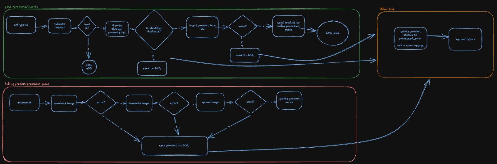

<a id="readme-top"></a>

<!-- TABLE OF CONTENTS -->
<details open>
  <summary>Table of Contents</summary>
  <ol>
    <li>
      <a href="#about-the-project">About The Project</a>
      <ul>
        <li><a href="#built-with">Built With</a></li>
        <li><a href="#why-bullmq">Why BullMQ?</a></li>
        <li><a href="#potential-improvements">Potential Improvements</a></li>
        <li><a href="#how-it-works">How it Works</a></li>
        <li><a href="#observations">Observations</a></li>
      </ul>
    </li>
    <li>
      <a href="#getting-started">Getting Started</a>
      <ul>
        <li><a href="#prerequisites">Prerequisites</a></li>
        <li><a href="#installation">Installation</a></li>
      </ul>
    </li>
    <li>
      <a href="#usage">Usage</a>
      <ul>
        <li><a href="#api">API</a></li>
        <li><a href="#database">Database</a></li>
        <li><a href="#redis">Redis</a></li>
        <li><a href="#docs">API Docs</a></li>
      </ul>
    </li>
    <li><a href="#contact">Contact</a></li>
  </ol>
</details>


<!-- ABOUT THE PROJECT -->
## About The Project


This project is a technical interview test built with NestJS, designed to simulate a real-world scenario of importing a batch of products, processing their images, and managing the workflow efficiently. The goal is to demonstrate proficiency in backend development, asynchronous task processing, and error handling.

<p align="right">(<a href="#readme-top">back to top</a>)</p>


### Built With
- NestJS: A progressive Node.js framework for building efficient and scalable server-side applications.

- BullMQ: A Redis-based queue system for handling background jobs and task processing.

- Redis: Used as the backend for BullMQ to manage job queues and ensure reliable task execution.

- Image Processing Libraries: Tools like sharp or imagemagick for compressing and resizing images.

- File Storage: Integration with cloud storage services (e.g., AWS S3) or local file systems for storing compressed images.

- PostgreSQL: A relational database for storing product data and processing status.

- Docker: Containerization for easy deployment and development environment setup.

<p align="right">(<a href="#readme-top">back to top</a>)</p>

### Why BullMQ?
Performance: BullMQ leverages Redis to handle large volumes of jobs efficiently.

Reliability: Failed jobs are automatically retried and moved to a DLQ if necessary.

Scalability: Multiple workers can process jobs concurrently, making the system highly scalable.

### Potential Improvements
1. Real-Time Notifications:

    Integrate with a notification service (e.g., email, Slack) to alert users about job status changes.

2. Distributed Processing:

    Scale the system horizontally by adding more workers and Redis instances.

3. Advanced Image Processing:

    Add support for additional image transformations, such as resizing, cropping, or watermarking.

4.  Cloud Integration:

    Enhance the system to upload images directly to cloud storage services like AWS S3 or Google Cloud Storage.

5. Dashboard:

    Build a dashboard to visualize job statuses, queue metrics, and system health.

6. Tests:
    If I had more time I would develop more automated tests, such as unit, integration and e2e tests 

### How it Works
1. **Product Import**:
  
    A batch of products is imported via an API endpoint.
    Each product is validated and added to a BullMQ queue for processing.

2. **Image Compression**:
    
    A worker picks up the job from the queue, downloads the product image, compresses it, and uploads it to the designated storage.

    **Obs**: The images are being uploaded inside src/uploads

3. **Status Tracking**:

    The system updates the status of each product in real-time:

4. **Processing: When the job is picked up by a worker**.

    - PROCESSED: When the image is compressed and uploaded successfully.
    - PROCESSING: When the image is being processed.
    - PROCESS_ERROR: If an error occurs during processing.

5. **Dead Letter Queue (DLQ)**:

    Jobs that fail after multiple retries are moved to a DLQ for manual inspection and resolution.

6. **Monitoring**:

    The system provides endpoints or logs to monitor the status of jobs, making it easy to track progress and identify issues.



### Observations
1. Logging:

    Currently, the system logs all events and errors to the console for local development purposes. However, this can be easily extended to integrate with advanced monitoring and logging tools like Datadog or New Relic. These tools would provide better insights, centralized logging, and real-time alerts for production environments.

2. File Storage:

    For local development, the system saves files locally to avoid unnecessary costs. However, the project is designed with flexibility in mind. The s3.adapter.ts file contains the implementation for uploading files to AWS S3. To enable S3 integration, you would need to:

      - Update app.module.ts to provide the S3Adapter instead of the LocalStorageAdapter.

      - Add the necessary environment variables for AWS (e.g., AWS_ACCESS_KEY_ID, AWS_SECRET_ACCESS_KEY, AWS_REGION, and AWS_BUCKET_NAME).

      - This modular approach ensures that the system can be easily adapted to different storage solutions without significant changes to the core logic.

<!-- GETTING STARTED -->
## Getting Started

This is an example of how you may give instructions on setting up your project locally.
To get a local copy up and running follow these simple example steps.

### Prerequisites

This is an example of how to list things you need to use the software and how to install them.
- Docker v27

### Installation

1. Clone the repo
   ```sh
   git clone https://github.com/gustablo/doris-interview.git
   ```
2. Create a .env file in the root directory then run
   ```sh
   cp .env.example .env
   ```
3. Run docker containers 
   ```sh
   docker compose up --build
   ```
4. Run the prisma migrations inside the container
   ```sh
   docker exec -it doris-api npx prisma migrate dev
   ```
   **If you face the error `cannot reach to database postgresdoris:5432` please stop all others containers you have set up and retry**


<p align="right">(<a href="#readme-top">back to top</a>)</p>


<!-- USAGE EXAMPLES -->
## Usage

### Security
To reach successfully the available endpoints you have to send the right api-key into the request headers. The api-key can be found in your .env file.

### API
The API is running on localhost:3000. Check the docs section to see all available endpoints.

### Database
You can access the database with these credentials:
```
Username: user
Password: password
Host:localhost
Port: 5435
Database: mydb
```

### Redis
You can access the redis with these credentials:
```
Username: default 
Password: 
Host: 127.0.0.1
Port: 6380 
```

### Tests
```bash
npm run test
``` 

### Docs
The API documentation is running on `http://localhost:3000/api/docs`

<p align="right">(<a href="#readme-top">back to top</a>)</p>

<!-- CONTACT -->
## Contact

Gustavo Pinheiro - [@gustablo](https://linkedin.com/in/gustablo) - gpinheiro2001@gmail.com 

<p align="right">(<a href="#readme-top">back to top</a>)</p>
